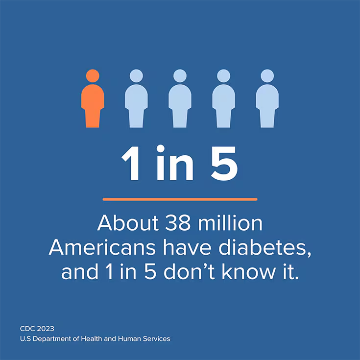
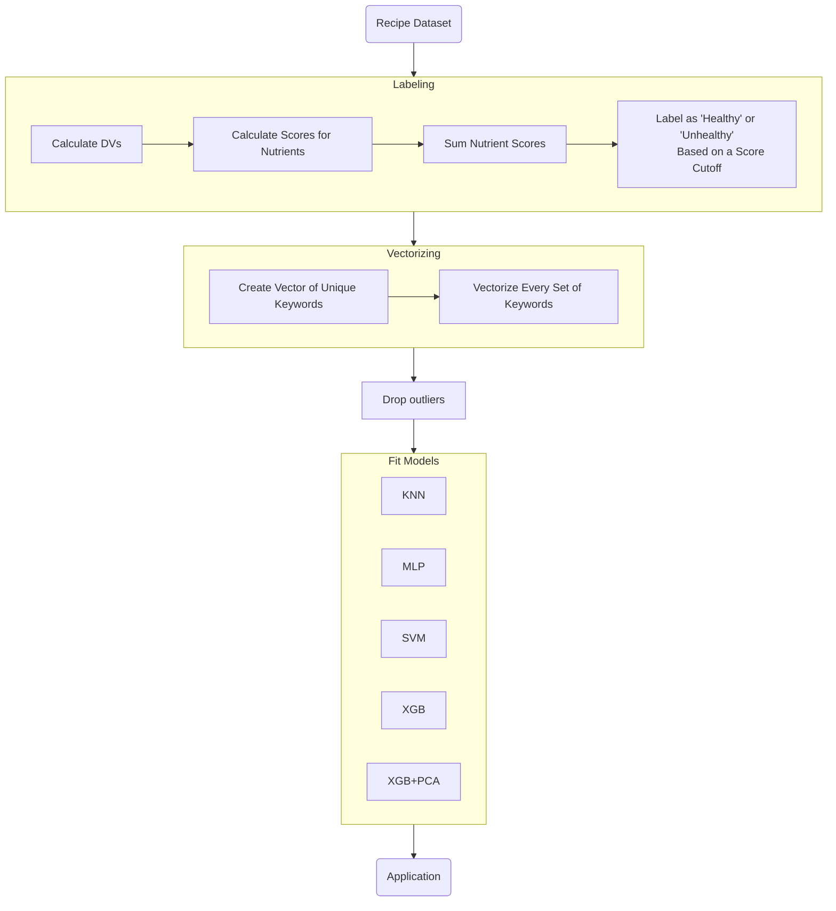

<div align="center">
  
  <h1 align="center">Meal Prep Aide</h3>
  <p align="center">Stuck on what to make for dinner? Let Meal Prep Aide guide the way!</p>
</div>

## Application Showcase

[](https://asciinema.org/a/656019)

### End User Application Instructions

1. Select keywords (limit of 2 to 5) of the meal that you are interested in making, by pressing <kbd>Tab</kbd>. You can also traverse different choices by using the arrows keys: <kbd>↑</kbd> or <kbd>↓</kbd>.

2. Press <kbd>Enter</kbd> once you are happy with the keywords you have selected.

3. Our recommendation and classification algorithm will discuss with you possible recipes that you can make and inform if you have made a healthy choice for your next meal.

## Application Functionality

Our application is a Command-Line Interface (CLI) tool, where the user can provide generic keywords regarding the meal theme that they want to prepare for their day. To get started, our application will download our recipes database from our Google Drive. Then, we will ask the user to select keywords that align with their meal preferences. After the user selects their keywords, our pre-trained machine learning model will classify whether their selected keywords will lead to a healthy meal, and we recommend recipes that align with their chosen keywords and output them in order of their nutrition score.

- Downloads the latest recipe database from our Google Drive
- Select multiple keywords based on your meal theme
- Classifies whether the meal prepared with your selected keywords will be healthy or unhealthy
- Fetches the top 5 recommended recipes that align with the selected keywords

### The Recommendation Algorithm

#TODO

## Significance & Novelty

<div align="center">
    <a href="https://www.cdc.gov/diabetes/health-equity/diabetes-by-the-numbers.html">
        
    </a>
</div>

> [!IMPORTANT]
> **A healthy diet is essential for good health and nutrition**  
<br/>It protects you against many chronic noncommunicable diseases, such as heart disease, diabetes and cancer. Eating a variety of foods and consuming less salt, sugars and saturated and industrially-produced trans-fats, are essential for healthy diet.[^1]

[^1]: https://www.who.int/initiatives/behealthy/healthy-diet

One's diet is crucial to living a healthy and long life, and many first world countries experience the rising issue of diabetes and diet-related illnesses due to how rich of a selection we have for a meal. With many players in the food industries, it becomes harder and harder for an average person to decide on a healthy meal at the end of the day. 

Through this application, we can streamline the headache of meal planning by suggesting healthy recipes to all of our users. Based on their keywords, we inform the user the healthiness of their decision and provide them various recipes by their nutrition score.

The novelty of this application lies within the streamlined distraction-free experience, where a user can plainly select keywords that align with their current meal interests, and receive the top five meals by their healthiness (nutrition score). Then, they are easily able to recreate the meal by following the recipe's link which provides them with an ingredient list and preparation instructions.

## Project Goals

**High-Level Goals**

- Help the public make better meal choices that align with their interests

- Help better inform the public regarding the healthiness of their dietary choices

- Provide recipe recommendations by healthiness to end-user based on the selected keywords, and only if there exists a recipe with all the selected keywords

**Technical Goals**

- Build a corpus of recipes that are manually labeled as healthy / unhealthy based on the
Food & Drug Administration (FDA) criterion on Nutritional Facts Panel(s) of various
meals

- Develop a classification algorithm that can derive whether a meal will be 
healthy / unhealthy based on selected keywords

- Develop a meal recommendation algorithm to provide healthy recipes that have all the keywords selected by the user

## Model Development Process

Below is a high-level overview of our development approach and process towards building the pre-trained machine learning model
that is used to classify if the selected keywords by the end-user will result in a healthy or unhealthy meal. Most of our model
development can be found within the `main.ipynb` file, and each model we tuned / trained can be found within `models/**.py`.



### Data Collection

This project is utilizing a [Kaggle Dataset](https://www.kaggle.com/datasets/irkaal/foodcom-recipes-and-reviews) that scraped Food.com's Recipes and Reviews. Our project mainly focuses on the recipes portion of the dataset, as we utilize this portion to help us classify certain keywords to the healthiness of a meal, recommend recipes by selected keywords and in order of nutrition score (healthiness of a meal).

### Preprocessing

#### Labeling

##### Calculate Daily Values (DVs)

Our original dataset did not come with a classification regarding if a specific recipe was healthy or not. As such, we had to manually figure out a method when it came classifying our recipes as healthy or unhealthy. Fortunately, the original dataset did come with the nutritional content of each recipe. The following nutritional categories were provided as a numerical value:

```
Calories (kcal)
FatContent (grams)
SaturatedFatContent (grams)
CholesterolContent (grams)
SodiumContent (grams)
CarbohydrateContent (grams)
FiberContent (grams)
SugarContent (grams)
ProteinContent (grams)
```

With this information, we had to define what nutrient amounts necessarily contributed towards a recipe / meal being classified as healthy, so we can associate keywords to it. Our definition of a healthy meal relied on the FDA's recommended "Daily Value on the Nutrition and Supplement Facts Label" article.[^2] The consensus for a healthy threshold regarding each nutrients' Daily Value percentages was 5-20%, where below this threshold was generally considered as low, and above was considered as high intake.

As each nutrient would have their own daily value measurement, we calculated the Daily Value Percentage for each recipe by converting each of their nutritional contents into their respective daily value percentages, and dropped columns where their nutrient category did not have a specified value from the FDA. Below is the reference guide[^2], which we utilized towards converting each of the provided nutrient categories within the recipe towards their respective daily value percentage.

| Nutrient            | Current Daily Value      |
|---------------------|--------------------------|
| Added sugars        | 50g                      |
| Biotin              | 30mcg                    |
| Calcium             | 1300mg                   |
| Chloride            | 2300mg                   |
| Choline             | 550mg                    |
| Cholesterol         | 300mg                    |
| Chromium            | 35mcg                    |
| Copper              | 0.9mg                    |
| Dietary Fiber       | 28g                      |
| Fat                 | 78g                      |
| Folate/Folic Acid   | 400mcg DFE               |
| Iodine              | 150mcg                   |
| Iron                | 18mg                     |
| Magnesium           | 420mg                    |
| Manganese           | 2.3mg                    |
| Molybdenum          | 45mcg                    |
| Niacin              | 16mg NE                  |
| Pantothenic Acid    | 5mg                      |
| Phosphorus          | 1250mg                   |
| Potassium           | 4700mg                   |
| Protein             | 50g                      |
| Riboflavin          | 1.3mg                    |
| Saturated fat       | 20g                      |
| Selenium            | 55mcg                    |
| Sodium              | 2300mg                   |
| Thiamin             | 1.2mg                    |
| Total carbohydrate  | 275g                     |
| Vitamin A           | 900mcg RAE               |
| Vitamin B6          | 1.7mg                    |
| Vitamin B12         | 2.4mcg                   |
| Vitamin C           | 90mg                     |
| Vitamin D           | 20mcg                    |
| Vitamin E           | 15mg alpha-tocopherol    |
| Vitamin K           | 120mcg                   |
| Zinc                | 11mg                     |

[^2]: https://www.fda.gov/food/nutrition-facts-label/daily-value-nutrition-and-supplement-facts-labels

At this point, each recipe had a daily value percentage representation of the following nutritional categories, which we then combined into our own metric that we reference as "nutrition score" which represents the healthiness of a recipe. Unfortunately, we had to drop the `SugarContent` from each recipe as the FDA did not have a clear unified consensus on the daily intake of sugar either in grams or as a daily value percentage.  

**Remaining Daily Value Percent (DVP) Representations of Nutrition Content within each Recipe**
```
Daily Value Percent Calories (%)
Daily Value Percent FatContent (%)
Daily Value Percent SaturatedFatContent (%)
Daily Value Percent CholesterolContent (%)
Daily Value Percent SodiumContent (%)
Daily Value Percent CarbohydrateContent (%)
Daily Value Percent FiberContent (%)
Daily Value Percent ProteinContent (%)
```
##### Nutrient Score Definition

We wanted to have a holistic approach towards this process to classify an entire recipe as healthy or unhealthy that involved all nutrient information provided from a recipe. To accomplish this, we crafted our own heuristic involving the nutrient information given (that were converted into Daily Value Percentages), as this heuristic is based on the FDA's recommendations. Our heuristic is called "Nutrient Score", which ranges from $[0, \infty]$, and this metric will be calculated across each of the remaining Daily Value Percentages (nutrients with FDA recommendation).

A Nutrient Score will evaluate as 0 for a specific nutrient if its Daily Value Percentage falls into the ideal threshold of 5-20%, otherwise it will begin increasing as the value moves away from the ideal threshold. The heuristic has the following parabolic function definition:

$$
\max\left(0,\alpha\left(x-5\right)\left(x-2\right)\right), \alpha = 0.1
$$

[](https://www.desmos.com/calculator/ixrgql7g0h)

The $x$ is the percentage of the daily value of a specific nutrient within a recipe.

The $\alpha$ value defines how steep of a punishment a recipe's nutrient will receive if it falls out of the ideal DVP (5-20%). The value was chosen by testing it across various foods and manually reviewing the nutrient scores that were generated for "superfoods" and "celebratory" dishes, and we came to selecting this value after many attempts of manual trial and testing.

The core focus of this function is to reward recipes with many nutrients that fall into the ideal threshold as "healthier" recipes, otherwise to "punish" recipes with nutrients that are out of the ideal threshold.

##### Calculate Scores for Nutrients

##### Sum Nutrient Scores

##### Label Recipes as 'Healthy'/'Unhealthy' Based On Nutrient Score Cutoff

- Define reasoning behind cutoff
- Percentage of recipes classified into each category


#### Vectorizing


#### Removing Outliers

- Manually via DataWrangler

## Model Evaluation (Test Results) 

- Explain Execution Context when it came to Model Training & Evaluation (Server Setup)
- Evaluation Metrics

#### Fit Models

- What models did we fit it under?
- What was its performance?
- Did it have any issues particular issues?
- Was its hyperparameters tuned, if so explain how?
- Show bar graph of model accuracies


## Discussion

## Conclusion

## Production Environment Dependency Requirements

To utilize our end-user application to generate recipe recommendations 
and its healthiness, you must have the following dependencies setup on your host machine. Each of the dependencies links to their respective setup instructions per your host machine's operating system.

- [Python >= 3.8](https://wiki.python.org/moin/BeginnersGuide/Download)
- [Git](https://git-scm.com/book/en/v2/Getting-Started-Installing-Git)
- Internet Connection to download recipe database from our public Google Drive

The following instructions will be for pip (Python's standard package manager), but can be adapted to your own desired package management / dependency management tool for Python.

See [Project Dependency Installation Instructions](#project-dependency-installation-instructions)

After you are done setting up the dependencies on your host machine, run the end-user application by executing the following command from the project's root directory.

> [!NOTE]
> The end-user application will download the recipes database into the `parquets` folder, and this file is about 300 MB, so it might take some time to download depending on your host machine's internet connection.

```sh
python main.py
```

## Development Environment Dependency Requirements

To investigate our code or develop it further for your own uses, please ensure all the following dependencies are installed on your host machine / development environment. The configuration can be customized to your liking, however, this is our current recommended setup for this project.

- [Python >= 3.8](https://wiki.python.org/moin/BeginnersGuide/Download)
- [Git](https://git-scm.com/book/en/v2/Getting-Started-Installing-Git)
- [Jupyter Notebook](https://code.visualstudio.com/docs/datascience/jupyter-notebooks)
- [VSCode](https://code.visualstudio.com/docs/setup/setup-overview)

See [Project Dependency Installation Instructions](#project-dependency-installation-instructions)

After you are done setting up the project dependency installation instructions, you can use the `main.ipynb` file to explore all of our work regarding the data processing, model training & development process. If you desire to develop the end-user CLI application further, then you see `main.py`.

## Project Dependency Installation Instructions

### 1. Clone our repository onto your Host Machine

To execute our end-user application, you must download our source code in order
to run the end-user application. To "download" our source code, clone our repository to your local system.

```sh
git clone https://github.com/GregShiner/recipe-classifier.git
```

### 2. Create & Activate a (venv) virtual environment

We prefer if user(s) activated a venv to avoid polluting their global package namespace on their computer, and is highly recommended when working on python packages.

To activate a venv, follow the [instructions](https://packaging.python.org/en/latest/guides/installing-using-pip-and-virtual-environments/#create-a-new-virtual-environment) dedicated towards your specific host machine's operating system in order to create and activate virtual environment. 

### 3. Install Required Packages

> [!CAUTION]
> Ensure that you have a virtual environment activated to avoid polluting your global package namespace.

In order to install the all dependencies (development & end-user application), you must install the required packages from our `requirements.txt`. To do this, you can execute the following commands within your terminal application at the project's root directory.

```sh
pip install -r requirements.txt
```

However, if you only plan on using the main application and not executing code in the notebook or other files, you can install a much smaller requirements file, `requirements_app.txt`.

```sh
pip install -r requirements_app.txt
```

### 4. Return to the Respective Environment Setup Instructions

Continue the instructions to setup your respective environment that you desire to do:

- See [Production Environment (End User Application)](#production-environment-dependency-requirements)
- See [Development Environment](#development-environment-dependency-requirements)
