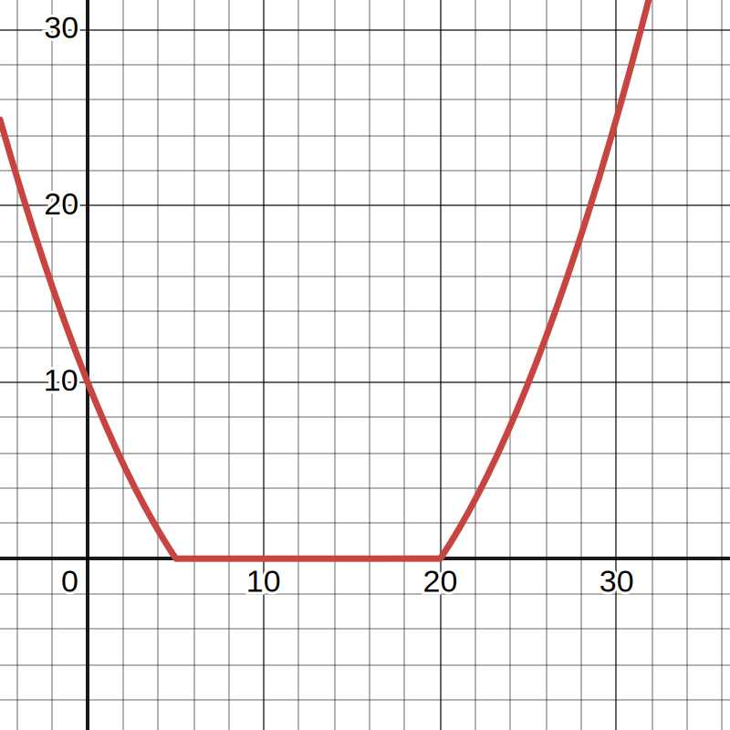
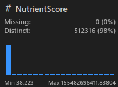
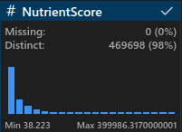
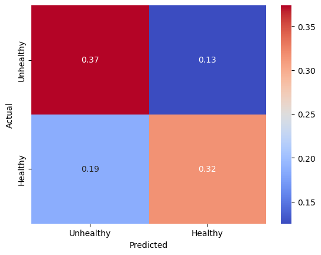
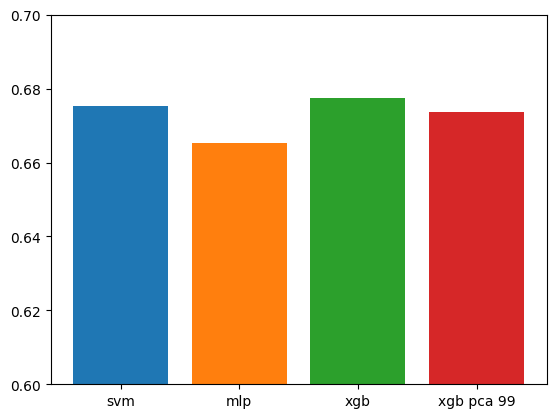

<div align="center">
  
  <h1 align="center">Meal Prep Aide</h3>
  <p align="center">Stuck on what to make for dinner? Let Meal Prep Aide guide the way!</p>
</div>

## Application Showcase

[](https://asciinema.org/a/656019)

### End User Application Instructions

1. Select keywords (limit of 2 to 5) of the meal that you are interested in making, by pressing <kbd>Tab</kbd>. You can also traverse different choices by using the arrows keys: <kbd>↑</kbd> or <kbd>↓</kbd>.

2. Press <kbd>Enter</kbd> once you are happy with the keywords you have selected.

3. Our recommendation and classification algorithm will discuss with you possible recipes that you can make and inform if you have made a healthy choice for your next meal.

## Application Functionality

Our application is a Command-Line Interface (CLI) tool, where the user can provide generic keywords regarding the meal theme that they want to prepare for their day. To get started, our application will download our recipes database from our Google Drive. Then, we will ask the user to select keywords that align with their meal preferences. After the user selects their keywords, our pre-trained machine learning model will classify whether their selected keywords will lead to a healthy meal, and we recommend recipes that align with their chosen keywords and output them in order of their nutrition score.

- Downloads the latest recipe database from our Google Drive
- Select multiple keywords based on your meal theme
- Classifies whether the meal prepared with your selected keywords will be healthy or unhealthy
- Fetches the top 5 recommended recipes that align with the selected keywords

### The Recommendation Algorithm

#TODO

## Significance & Novelty

<div align="center">
    <a href="https://www.cdc.gov/diabetes/health-equity/diabetes-by-the-numbers.html">
        
    </a>
</div>

> [!IMPORTANT]
> **A healthy diet is essential for good health and nutrition**  
<br/>It protects you against many chronic noncommunicable diseases, such as heart disease, diabetes and cancer. Eating a variety of foods and consuming less salt, sugars and saturated and industrially-produced trans-fats, are essential for healthy diet.[^1]

[^1]: https://www.who.int/initiatives/behealthy/healthy-diet

One's diet is crucial to living a healthy and long life, and many first world countries experience the rising issue of diabetes and diet-related illnesses due to how rich of a selection we have for a meal. With many players in the food industries, it becomes harder and harder for an average person to decide on a healthy meal at the end of the day. 

Through this application, we can streamline the headache of meal planning by suggesting healthy recipes to all of our users. Based on their keywords, we inform the user the healthiness of their decision and provide them various recipes by their nutrition score.

The novelty of this application lies within the streamlined distraction-free experience, where a user can plainly select keywords that align with their current meal interests, and receive the top five meals by their healthiness (nutrition score). Then, they are easily able to recreate the meal by following the recipe's link which provides them with an ingredient list and preparation instructions.

## Project Goals

**High-Level Goals**

- Help the public make better meal choices that align with their interests

- Help better inform the public regarding the healthiness of their dietary choices

- Provide recipe recommendations by healthiness to end-user based on the selected keywords, and only if there exists a recipe with all the selected keywords

**Technical Goals**

- Build a corpus of recipes that are manually labeled as healthy / unhealthy based on the
Food & Drug Administration (FDA) criterion on Nutritional Facts Panel(s) of various
meals

- Develop a classification algorithm that can derive whether a meal will be 
healthy / unhealthy based on selected keywords

- Develop a meal recommendation algorithm to provide healthy recipes that have all the keywords selected by the user

## Model Development Process

Below is a high-level overview of our development approach and process towards building the pre-trained machine learning model
that is used to classify if the selected keywords by the end-user will result in a healthy or unhealthy meal. Most of our model
development can be found within the `main.ipynb` file, and each model we tuned / trained can be found within `models/**.py`.


### Data Collection

This project is utilizing a [Kaggle Dataset](https://www.kaggle.com/datasets/irkaal/foodcom-recipes-and-reviews) that scraped Food.com's Recipes and Reviews. Our project mainly focuses on the recipes portion of the dataset, as we utilize this portion to help us classify certain keywords to the healthiness of a meal, recommend recipes by selected keywords and in order of nutrition score (healthiness of a meal).

### Preprocessing

#### Labeling

##### Calculate Daily Values (DVs)

Our original dataset did not come with a classification regarding if a specific recipe was healthy or not. As such, we had to manually figure out a method when it came classifying our recipes as healthy or unhealthy. Fortunately, the original dataset did come with the nutritional content of each recipe. The following nutritional categories were provided as a numerical value:

```
Calories (kcal)
FatContent (grams)
SaturatedFatContent (grams)
CholesterolContent (grams)
SodiumContent (grams)
CarbohydrateContent (grams)
FiberContent (grams)
SugarContent (grams)
ProteinContent (grams)
```

With this information, we had to define what nutrient amounts necessarily contributed towards a recipe / meal being classified as healthy, so we can associate keywords to it. Our definition of a healthy meal relied on the FDA's recommended "Daily Value on the Nutrition and Supplement Facts Label" article.[^2] The consensus for a healthy threshold regarding each nutrients' Daily Value percentages was 5-20%, where below this threshold was generally considered as low, and above was considered as high intake.

As each nutrient would have their own daily value measurement, we calculated the Daily Value Percentage for each recipe by converting each of their nutritional contents into their respective daily value percentages, and dropped columns where their nutrient category did not have a specified value from the FDA. Below is the reference guide[^2], which we utilized towards converting each of the provided nutrient categories within the recipe towards their respective daily value percentage.

| Nutrient            | Current Daily Value      |
|---------------------|--------------------------|
| Added sugars        | 50g                      |
| Biotin              | 30mcg                    |
| Calcium             | 1300mg                   |
| Chloride            | 2300mg                   |
| Choline             | 550mg                    |
| Cholesterol         | 300mg                    |
| Chromium            | 35mcg                    |
| Copper              | 0.9mg                    |
| Dietary Fiber       | 28g                      |
| Fat                 | 78g                      |
| Folate/Folic Acid   | 400mcg DFE               |
| Iodine              | 150mcg                   |
| Iron                | 18mg                     |
| Magnesium           | 420mg                    |
| Manganese           | 2.3mg                    |
| Molybdenum          | 45mcg                    |
| Niacin              | 16mg NE                  |
| Pantothenic Acid    | 5mg                      |
| Phosphorus          | 1250mg                   |
| Potassium           | 4700mg                   |
| Protein             | 50g                      |
| Riboflavin          | 1.3mg                    |
| Saturated fat       | 20g                      |
| Selenium            | 55mcg                    |
| Sodium              | 2300mg                   |
| Thiamin             | 1.2mg                    |
| Total carbohydrate  | 275g                     |
| Vitamin A           | 900mcg RAE               |
| Vitamin B6          | 1.7mg                    |
| Vitamin B12         | 2.4mcg                   |
| Vitamin C           | 90mg                     |
| Vitamin D           | 20mcg                    |
| Vitamin E           | 15mg alpha-tocopherol    |
| Vitamin K           | 120mcg                   |
| Zinc                | 11mg                     |

[^2]: https://www.fda.gov/food/nutrition-facts-label/daily-value-nutrition-and-supplement-facts-labels

At this point, each recipe had a daily value percentage representation of the following nutritional categories, which we then combined into our own metric that we reference as "nutrition score" which represents the healthiness of a recipe. Unfortunately, we had to drop the `SugarContent` from each recipe as the FDA did not have a clear unified consensus on the daily intake of sugar either in grams or as a daily value percentage.  

**Remaining Daily Value Percent (DVP) Representations of Nutrition Content within each Recipe**
```
Daily Value Percent Calories (%)
Daily Value Percent FatContent (%)
Daily Value Percent SaturatedFatContent (%)
Daily Value Percent CholesterolContent (%)
Daily Value Percent SodiumContent (%)
Daily Value Percent CarbohydrateContent (%)
Daily Value Percent FiberContent (%)
Daily Value Percent ProteinContent (%)
```
##### Nutrient Score Definition

We wanted to have a holistic approach towards this process to classify an entire recipe as healthy or unhealthy that involved all nutrient information provided from a recipe. To accomplish this, we crafted our own heuristic involving the nutrient information given (that were converted into Daily Value Percentages), as this heuristic is based on the FDA's recommendations. Our heuristic is called "Nutrient Score", which ranges from $[0, \infty]$, and this metric will be calculated across each of the remaining Daily Value Percentages (nutrients with FDA recommendation).

A Nutrient Score will evaluate as 0 for a specific nutrient if its Daily Value Percentage falls into the ideal threshold of 5-20%, otherwise it will begin increasing as the value moves away from the ideal threshold. The heuristic has the following parabolic function definition:

$$
\max\left(0,\alpha\left(x-5\right)\left(x-2\right)\right), \alpha = 0.1
$$

[](https://www.desmos.com/calculator/ixrgql7g0h)

The $x$ is the percentage of the daily value of a specific nutrient within a recipe.

The $\alpha$ value defines how steep of a punishment a recipe's nutrient will receive if it falls out of the ideal DVP (5-20%). The value was chosen by testing it across various foods and manually reviewing the nutrient scores that were generated for "superfoods" and "celebratory" dishes, and we came to selecting this value after many attempts of manual trial and testing.

The core focus of this function is to reward recipes with many nutrients that fall into the ideal threshold as "healthier" recipes, otherwise to "punish" recipes with nutrients that are out of the ideal threshold.

##### Calculate Scores for Nutrients

After defining our heuristic, we calculated the nutrient score for each nutrient (per their respective Daily Values), and converted each Nutrient from their Daily Value Percentage representation into their Nutrient Score representation

##### Sum Nutrient Scores

The core goal of this nutrient score is to sum up all nutrients into a single heuristic that can represent the healthiness of a meal. As such, we summed up every nutrients' nutrient score into one column. Therefore, we can now sort the recipes by their healthiness factor, as recipes that sum closer to 0 represent recipes that have nutrients that fall within the ideal threshold.

##### Label Recipes as 'Healthy'/'Unhealthy' Based On Nutrient Score Cutoff

To label a recipe as 'Healthy' / 'Unhealthy', we calculated the percentage of recipes that are within the DV for calories (5-20% of 2000 calories), otherwise known as where recipes had scored 0 for their nutrient score for calories. This percentile of recipes ended up being the threshold for recipe, and this resulted in 50.14% of recipes being labeled as healthy, as most recipes did not exceed the FDA recommended threshold for calories.

#### Vectorizing

At this point, every recipe has been manually tagged with our nutrient score and healthy / unhealthy classifier, and we now need to extract the keywords that can represent various recipes from our corpus. Fortunately, our original dataset had every single recipe tagged with keywords that were meant for search engine optimization. We took every single keyword that were utilized across all recipes within our dataset and built our own keyword corpus, which had 315 unique keywords. Most recipes used anywhere between 2-5 keywords to help them be discoverable on the web, and we will end up using the same limit when it comes to end-user figuring out what meal to make and classify whether their meal will end up being a healthy or unhealthy one.

Using this keyword corpus, we went through every single recipe and transformed their keywords' column into a vector of 0s and 1s that represented whether a specific keyword existed within a recipe. As such, we vectorized every set of keywords within each recipe into a one-hot-encoded fashion that is based on our own keyword corpus.

#### Removing Outliers

With our nutrient score, we were able to quite easily see meals that were more oriented for parties or had data entry errors, and we went through and removed any recipe that had a nutrient score above 400,000.

We utilized VSCode's Data Wrangler in order to identify outliers, but any recipe score with a nutrient score at this range simply meant that each of their nutrient daily values were nearly hundreds' of times more than the FDA recommendations.

**Before Removing Outliers**



**After Removing Outliers**



## Model Evaluation (Test Results) 

We were now able to start training up models that can classify the healthiness potential of a possible meal from keywords provided from a user. However, we have such a large dataset of recipes (450k+ recipes), and a high dimensionality (especially when it came to keywords). As such, we ran all of our model training on all 8 hardware threads of an Intel(R) Xeon(R) CPU E5-2637 v2 @ 3.50GHz.

Before we fit models, we defined that our evaluation metrics. Our problem is a binary classification that takes in keywords in order to evaluate whether the possible meal will be "Healthy" or "Unhealthy", and as such we utilized log loss for our loss function, and utilized accuracy as our main evaluation metric.

### Fit Classifier Models (& Train Models)

Each of the models were fit with KFold Cross Validation with our dataset, where K was set to 3, in order to prevent overfitting.

#### K Nearest Neighbors (KNN)

We attempted KNN using Scikit-learn's KNNClassifier on our hardware, however this model was near impossible to train as our dataset was too large and the dimensions off the keywords were too much for our hardware to process. From our preliminary results, we had the best result of 0.645 with 11 neighbors, and decided against pursuing hyperparameter training as it would've taken too long and the accuracy was quite poor.

#### Multilayer Perceptron (MLP)

Then, we attempted building a simple neural network with Scikit-learn's MLP Classifier, where the activation function was set to Rectified Linear Units (ReLU) by default. Our initial results were more accurate, but it was still slow to train due to our dataset. However, as the accuracy was higher, we decided to hyperparameter training the MLPClassifier with the following parameters via GridSearchCV:

```
'hidden_layer_sizes': [(100,), (100, 100), (100, 100, 100)],
'alpha': [0.0001, 0.001, 0.01]
```

Our best result was an accuracy of 0.6774 with an alpha of 0.01, and a single hidden layer of 100 neurons using the ReLU activation function.

#### Support Vector Machines (SVM)

Afterwards, we gave SVM a shot, via Scikit-learn's Support Vector Classifier, which happened to do better initially with a 10% sample of our dataset, however by far was the slowest to train, as we delved into hyperparameter tuning on this model (with the entire dataset) for over 72 hours, which resulted in 48 tuned models.

We tuned the following hyperparameters:

```
'C': [0.1, 1, 10, 100],
'kernel': ['linear', 'poly', 'rbf', 'sigmoid']
```

Our best performing model had an accuracy of 0.6752, which utilized the radial basis function for its kernel and C = 1.

As this model performed well, we applied principal component analysis (PCA) in order to reduce the training times, and see some hopes of increasing the accuracy. As such, we applied PCA with the following target variances: 90%, 95%, 99%. Each PCA version of the dataset had also undergone the same hyperparameter tuning with the SVM model. This reduced our components from an initial 315 (derived from the amount of keywords) into 59, 84, and 150 components respectively. Unfortunately, even with the faster training times, the models ended up performing poorer in accuracy. 

#### XGB

Lastly, our best model performer in terms of accuracy and training time, XGBoost (via xgboost's XGBClassifier), trained the fastest and performed the best (27 models within 1 minute across all 8 cores).

We tuned the following parameters with GridSearchCV:

```
'n_estimators': [100, 200, 300], 
'max_depth': [3, 5, 7]
```

The best model resulted with an accuracy of 0.6774 with a max depth of 7 and n_estimators set to 100.

As this model performed so well, we decided delve a bit more and generate precision, f1-score, and recall metrics, alongside a confusion matrix to see where the error in our accuracies is coming from, but it was hard to identify if the problem was leaning towards a certain incorrect classification.



**Classification Report**
```
xgb
              precision    recall  f1-score   support

           0       0.75      0.66      0.70    293882
           1       0.62      0.71      0.66    228635

    accuracy                           0.68    522517
   macro avg       0.68      0.69      0.68    522517
weighted avg       0.69      0.68      0.69    522517
```

#### XGB + PCA

As XGB was able to train so fast, we delved into applying hyperparameter tuning with the same metrics, but with PCA target variances of 90%, 95%, and 99%. 

We also trained the model with PCA applications of 90%, 95%, 99% (59, 84, and 150 components out of 315) of the target variance alongside the hyperparameter tuning applied within XGB.

Unfortunately, we ended up getting worse accuracies, but it is worth to note that the accuracies were very close to the true value from the original XGB model which used the entire dataset and keywords vector.

| Target Variance (%) | n_components | Accuracy Score (XGB Original = 0.6774) |
|---------------------|--------------|----------------------------------------|
| 90                  | 59           | 0.6736                                 |
| 95                  | 84           | 0.6723                                 |
| 99                  | 150          | 0.6708                                 |

### Model Evaluation Remarks

Overall, the best performing model was XGB at 0.6774 for our binary classification problem using keywords to identify if the possible recipes that could be made would end up being healthy. Notably, PCA did not improve our accuracies, but did prove that dimensionality reduction is completely possible with a bit of minor loss in accuracies, and most of the models hovered around the 0.6-0.7 range, indicating our data source might be the problem.



## Discussion

### Project Issues and Limitations

Many of our issues stem from our large dataset and the encoding format for our keywords. Our training times were heavily impacted because of training using 500,000 recipes, and attempting to use a 315 dimension keyword vector reduced the speed at which training could happen for any type of model. We believe this could have been accelerated if we hand-rolled our own implementations of these classifiers towards a specific GPU-architecture for GPU acceleration, but we did not have the knowledge or time to do so.

Most Importantly, our poor accuracy for our binary classification was alerting at first, but once we saw the trend across multiple models, we wondered if our keyword encoding was incorrect, however this turned out to not be the case, as we started manually reviewing the keywords for certain recipes and noticed there were some inaccurate keywords tied to certain recipes. Moreover, we manually tagged each recipe as healthy or unhealthy based on our own subjective definition derived from the FDA's recommendations of Daily Value, which could be the source of our error. Our nutrition score isn't factually based, and each nutrient is being taken into account at the same weight. As such, this could have caused our keywords to have little to no correlation with our manual tagging of each recipe's healthiness status (nutrition score).

### Course Learnings

We applied numerous aspects of this course's learnings, as we initially kicked off this project with a bit of exploratory data analysis, where we utilized VSCode's Data Wrangler extension to visually analyze for outliers. Furthermore, we applied our own function in order to preprocess the data into the format which we desired, so we could classify keywords into whether it would lead to a healthy recipe being made. Lastly, we trained various models that were taught in the class and performed hyperparameter tuning on the models, alongside training the models with small samples in order to evaluate their initial performance.

## Conclusion

Overall, we hoped for better accuracies but ran into many issues from our data source, and hope to improve our definition of what comprises a healthy recipe / meal. With the input of a nutritionist, and a more concrete definition of a meal's healthiness, then I believe we could improve our accuracies by leaps and bounds.

## Production Environment Dependency Requirements

To utilize our end-user application to generate recipe recommendations 
and its healthiness, you must have the following dependencies setup on your host machine. Each of the dependencies links to their respective setup instructions per your host machine's operating system.

- [Python >= 3.8](https://wiki.python.org/moin/BeginnersGuide/Download)
- [Git](https://git-scm.com/book/en/v2/Getting-Started-Installing-Git)
- Internet Connection to download recipe database from our public Google Drive

The following instructions will be for pip (Python's standard package manager), but can be adapted to your own desired package management / dependency management tool for Python.

See [Project Dependency Installation Instructions](#project-dependency-installation-instructions)

After you are done setting up the dependencies on your host machine, run the end-user application by executing the following command from the project's root directory.

> [!NOTE]
> The end-user application will download the recipes database into the `parquets` folder, and this file is about 300 MB, so it might take some time to download depending on your host machine's internet connection.

```sh
python main.py
```

## Development Environment Dependency Requirements

To investigate our code or develop it further for your own uses, please ensure all the following dependencies are installed on your host machine / development environment. The configuration can be customized to your liking, however, this is our current recommended setup for this project.

- [Python >= 3.8](https://wiki.python.org/moin/BeginnersGuide/Download)
- [Git](https://git-scm.com/book/en/v2/Getting-Started-Installing-Git)
- [Jupyter Notebook](https://code.visualstudio.com/docs/datascience/jupyter-notebooks)
- [VSCode](https://code.visualstudio.com/docs/setup/setup-overview)

See [Project Dependency Installation Instructions](#project-dependency-installation-instructions)

After you are done setting up the project dependency installation instructions, you can use the `main.ipynb` file to explore all of our work regarding the data processing, model training & development process. If you desire to develop the end-user CLI application further, then you see `main.py`.

## Project Dependency Installation Instructions

### 1. Clone our repository onto your Host Machine

To execute our end-user application, you must download our source code in order
to run the end-user application. To "download" our source code, clone our repository to your local system.

```sh
git clone https://github.com/GregShiner/recipe-classifier.git
```

### 2. Create & Activate a (venv) virtual environment

We prefer if user(s) activated a venv to avoid polluting their global package namespace on their computer, and is highly recommended when working on python packages.

To activate a venv, follow the [instructions](https://packaging.python.org/en/latest/guides/installing-using-pip-and-virtual-environments/#create-a-new-virtual-environment) dedicated towards your specific host machine's operating system in order to create and activate virtual environment. 

### 3. Install Required Packages

> [!CAUTION]
> Ensure that you have a virtual environment activated to avoid polluting your global package namespace.

In order to install the all dependencies (development & end-user application), you must install the required packages from our `requirements.txt`. To do this, you can execute the following commands within your terminal application at the project's root directory.

```sh
pip install -r requirements.txt
```

However, if you only plan on using the main application and not executing code in the notebook or other files, you can install a much smaller requirements file, `requirements_app.txt`.

```sh
pip install -r requirements_app.txt
```

### 4. Return to the Respective Environment Setup Instructions

Continue the instructions to setup your respective environment that you desire to do:

- See [Production Environment (End User Application)](#production-environment-dependency-requirements)
- See [Development Environment](#development-environment-dependency-requirements)
