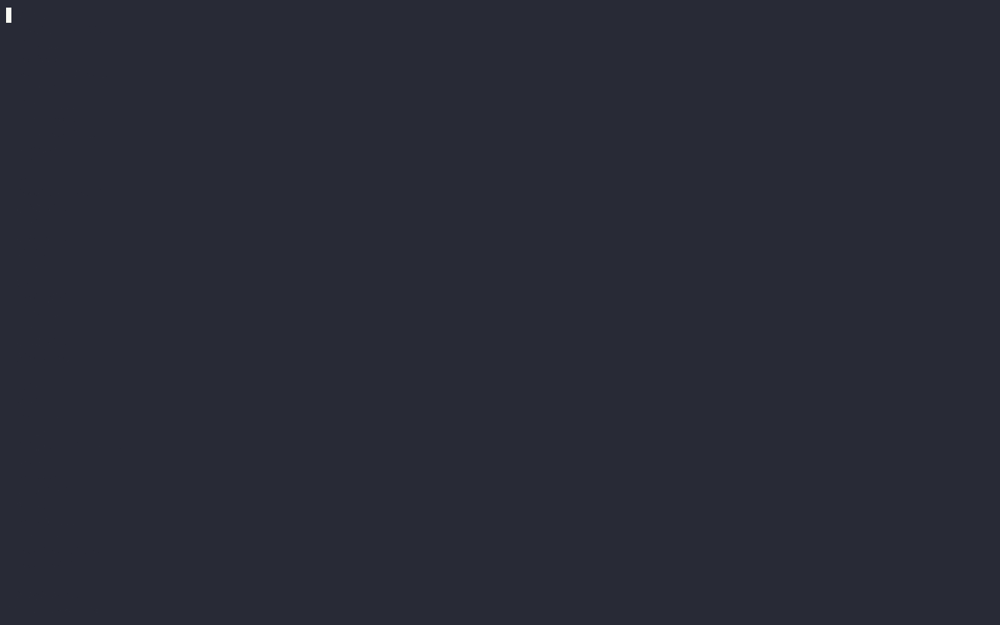

<div align="center">
  
  <h1 align="center">Meal Prep Aide</h3>
  <p align="center">Stuck on what to make for dinner? Let Meal Prep Aide guide the way!</p>
</div>

## Project Goals

**High-Level Goals**

- Help the public make better meal choices that align with their interests
- Help better inform the public regarding the healthiness of their dietary choices
- Provide recipe recommendations by healthiness to end-user based on the selected keywords, and only if there exists a recipe with all the selected keywords

**Technical Goals**

- Build a corpus of recipes that are manually labeled as healthy / unhealthy based on the
Food & Drug Administration (FDA) criterion on Nutritional Facts Panel(s) of various
meals

- Develop a classification algorithm that can derive whether a meal will be 
healthy / unhealthy based on selected keywords

- Develop a meal recommendation algorithm to provide healthy recipes that have all the keywords selected by the user

## Significance & Novelty


## Application Showcase

[](https://asciinema.org/a/656019)

## Production Environment Dependency Requirements

To utilize our end-user application to generate recipe recommendations 
and its healthiness, you must have the following dependencies setup on your host machine. Each of the dependencies links to their respective setup instructions per your host machine's operating system.

- [Python >= 3.8](https://wiki.python.org/moin/BeginnersGuide/Download)
- [Git](https://git-scm.com/book/en/v2/Getting-Started-Installing-Git)
- Internet Connection to download recipe database from our public Google Drive

The following instructions will be for pip (Python's standard package manager), but can be adapted to your own desired package management / dependency management tool for Python.

See [Project Dependency Installation Instructions](#project-dependency-installation-instructions)

After you are done setting up the dependencies on your host machine, run the end-user application by executing the following command from the project's root directory.

> [!NOTE]
> The end-user application will download the recipes database into the `parquets` folder, and this file is about 300 MB, so it might take some time to download depending on your host machine's internet connection.

```sh
python main.py
```

### End User Application Instructions

1. Select keywords of the meal that you are interested in making, by pressing <kbd>Tab</kbd>. You can also traverse different choices by using the arrows keys: <kbd>↑</kbd> or <kbd>↓</kbd>.

2. Press <kbd>Enter</kbd> once you are happy with the keywords you have selected.

3. Our recommendation and classification algorithm will discuss with you possible recipes that you can make and inform if you have made a healthy choice for your next meal.

## Development Environment Dependency Requirements

To investigate our code or develop it further for your own uses, please ensure all the following dependencies are installed on your host machine / development environment. The configuration can be customized to your liking, however, this is our current recommended setup for this project.

- [Python >= 3.8](https://wiki.python.org/moin/BeginnersGuide/Download)
- [Git](https://git-scm.com/book/en/v2/Getting-Started-Installing-Git)
- [Jupyter Notebook](https://code.visualstudio.com/docs/datascience/jupyter-notebooks)
- [VSCode](https://code.visualstudio.com/docs/setup/setup-overview)

See [Project Dependency Installation Instructions](#project-dependency-installation-instructions)

After you are done setting up the project dependency installation instructions, you can use the `main.ipynb` file to explore all of our work regarding the data processing, model training & development process. If you desire to develop the end-user CLI application further, then you see `main.py`.

## Project Dependency Installation Instructions

### 1. Clone our repository onto your Host Machine

To execute our end-user application, you must download our source code in order
to run the end-user application. To "download" our source code, clone our repository to your local system.

```sh
git clone https://github.com/GregShiner/recipe-classifier.git
```

### 2. Create & Activate a (venv) virtual environment

We prefer if user(s) activated a venv to avoid polluting their global package namespace on their computer, and is highly recommended when working on python packages.

To activate a venv, follow the [instructions](https://packaging.python.org/en/latest/guides/installing-using-pip-and-virtual-environments/#create-a-new-virtual-environment) dedicated towards your specific host machine's OS in order to create and activate virtual environment. 

### 3. Install Required Packages

> [!CAUTION]
> Ensure that you have a virtual environment activated to avoid polluting your global package namespace.

In order to install the all dependencies (development & end-user application), you must install the required packages from our `requirements.txt`. To do this, you can execute the following commands within your terminal application at the project's root directory.

```sh
pip install -r requirements.txt
```

However, if you only plan on using the main application and not executing code in the notebook or other files, you can install a much smaller requirements file, `requirements_app.txt`.

```sh
pip install -r requirements_app.txt
```

### 4. Return to the Respective Environment Setup Instructions

Continue the instructions to setup your respective environment that you desire to do:

- See [Production Environment (End User Application)](#production-environment-dependency-requirements)
- See [Development Environment](#development-environment-dependency-requirements)
